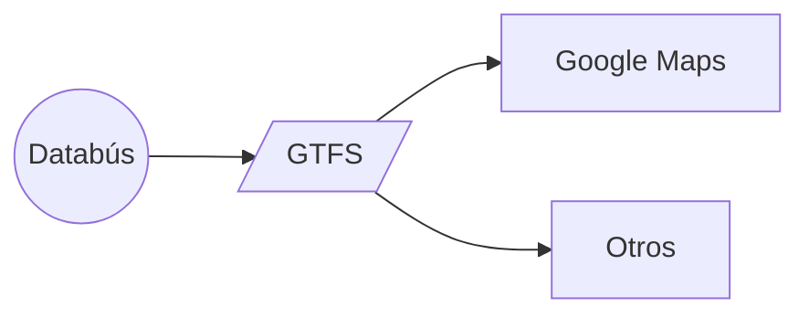
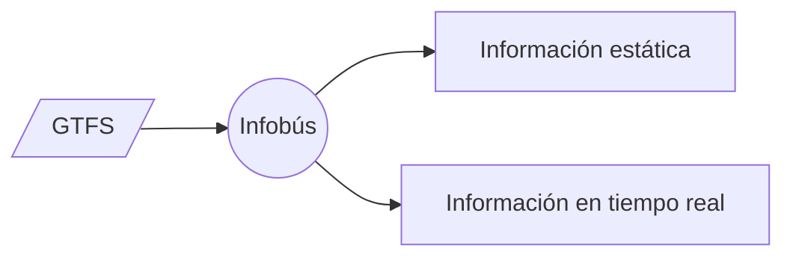

- Primer sistema inteligente de transporte público del país
- Pequeño laboratorio de pruebas para investigación y desarrollo
- Gestión integral de la información para las personas usuarias

---
layout: two-cols
kicker: Sistemas tecnológicos
title: Información del transporte público
---

 

Productor de datos estandarizados

::right::

 

Consumidor de datos estandarizados

