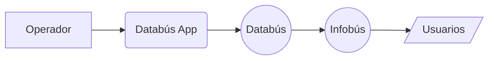

---
layout: steps
kicker: ¿Qué hace el operador en la aplicación?
title: El flujo de un viaje, paso a paso
steps:
  - title: Configurar viaje
    desc: Ruta, recorrido y tipo de viaje
    icon: "lucide:fast-forward"
  - title: Confirmar e iniciar
    desc: Revisar los datos antes de salir
    icon: "lucide:play"
  - title: Interrumpir viaje
    desc: Opcional (solamente en eventualidades)
    icon: "lucide:pause"
  - title: Finalizar viaje
    desc: Opcional (el sistema lo hace automáticamente)
    icon: "lucide:square"
---

---
layout: section
kicker: Demostración
title: Databús App
---
