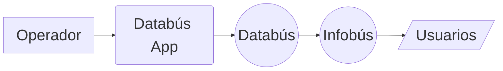

---
layout: steps
kicker: ¿Qué hace el operador en la app?
title: El flujo de un viaje, paso a paso
steps:
  - title: Configurar viaje
    desc: Ruta, recorrido y tipo de viaje
    icon: "lucide:list-checks"
  - title: Confirmar
    desc: Revisar los datos antes de salir
    icon: "lucide:check"
  - title: Iniciar viaje
    desc: 
    icon: "lucide:play"
  - title: Finalizar viaje
    desc:
    icon: "lucide:square"
---

---
layout: define
kicker: Demo
term: Demo
definition: Jae will cook.
points:
  - Demo 1
  - Demo 2
  - Demo 3
---
