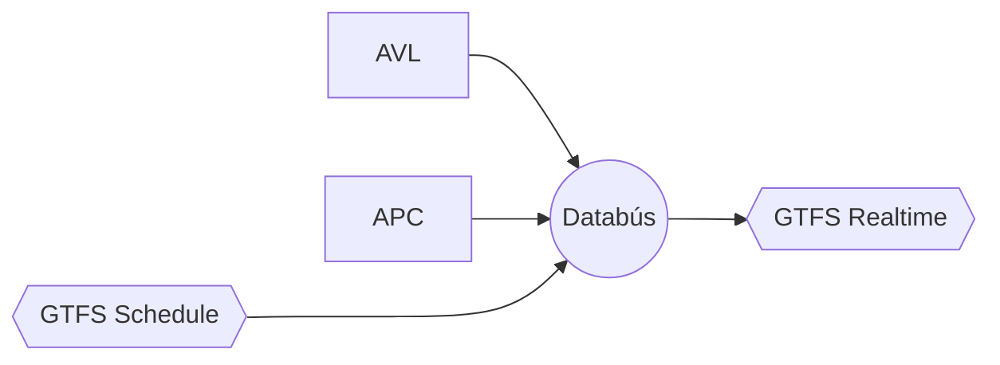
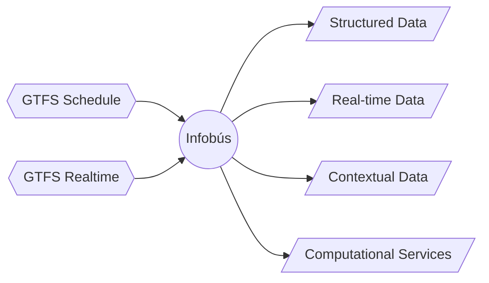
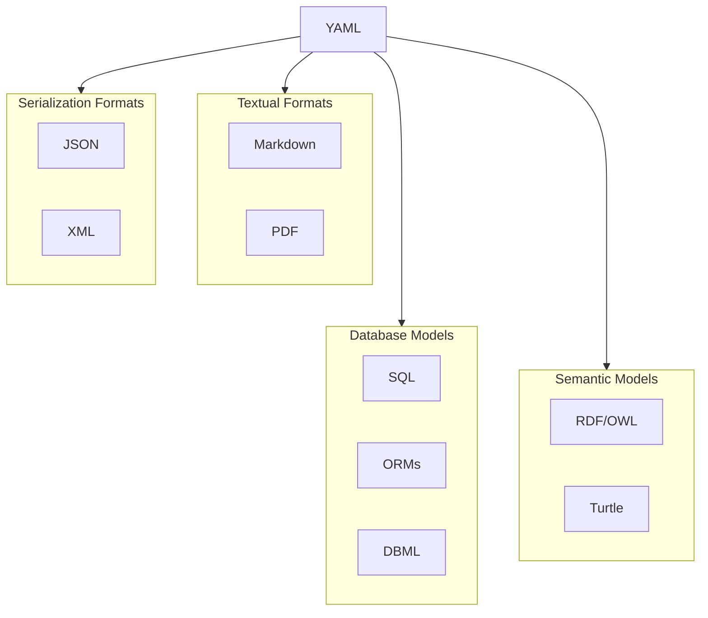

---
layout: section
title: ¿Qué es bUCR?
kicker: Plan piloto
---

---
src: ./pages/bucr.md
hide: false
---

---
layout: section
title: ¿Cómo recopilamos y publicamos los datos?
kicker: Databús
---

---
src: ./pages/databus.md
hide: false
---

---
layout: section
title: ⁠¿Cómo distribuimos la información?
kicker: Infobus
---

---
src: ./pages/infobus.md
hide: false
---

---
layout: section
title: ¿Cuál es el rol de los operadores?
kicker: Choferes y despachadores
---

---
src: ./pages/operators.md
hide: false
---

---
layout: section
title: Siguientes pasos
kicker: Lanzamiento del plan piloto
---

---
layout: default
title: Pruebas del sistema
---

| Fechas             | Actividad                           |
| ------------------ | ----------------------------------- |
| 10 al 14 de agosto | Implementación de Databús e Infobús |
| 17 al 21 de agosto | Pruebas del sistema con choferes    |
| 25 de agosto       | Demostración en evento              |

---
layout: default
title: Evento de sistemas de información del transporte público
---

- Participación de ARESEP, MOPT, CTP, INCOFER, BCCR
- Presentación de Databús e Infobús
- Presentación del sistema nacional de información del transporte público

---
layout: two-cols
title: Laboratorio de Sistemas Inteligentes de Movilidad
kicker: SIMOVI
---

- Número de proyecto: C3184
- Fecha de inicio: 01 de marzo de 2023
- Fecha de finalización: 31 de julio de 2026
- Estudiantes participantes: 9+

::right::

<Person name="Fabián Abarca Calderón" role="Coordinador / EIE" photo="images/fabian.png" />
<br>
<Person name="Jose Flores Quirós" role="Colaborador / EIE" photo="images/jose.png" />
<br>
<Person name="Oscar Porras Silesky" role="Colaborador / EIE" photo="images/oscar.png" />
<br>
<Person name="Felipe Quesada Parada" role="Colaborador / EIC" photo="images/felipe.png" />

---
layout: feature
kicker: SIMOVI
title: Intelligent Mobility Systems Lab
features:
  - icon: "lucide:users"
    title: Who we are
    desc: A laboratory founded in 2025 at the University of Costa Rica.
  - icon: "lucide:activity"
    title: What we do
    desc: Research and development in intelligent mobility systems.
  - icon: "lucide:map"
    title: Research
    desc: Data analysis, systems engineering, and service design.
  - icon: "lucide:code"
    title: Development
    desc: End-to-end transit data platforms and programming utilities.
---

---
layout: diagram
kicker: A Producer of GTFS Data
title: Databús
build: true
note: An open-source real-time server to process tracking and telemetry data from transit vehicles and generate GTFS Realtime feeds.
---



---
layout: diagram
kicker: A Consumer of GTFS Data
title: Infobús
build: true
note: Four interfaces that can be consumed by third-party applications, including websites, mobile apps, information kiosks, and digital signage.
---



---
layout: section
title: Projects
---

Data collection and system development

---
layout: feature
kicker: Pilot Plan at the University of Costa Rica
title: bUCR
features:
  - icon: "lucide:file-clock"
    title: GTFS
    desc: Schedule and Realtime data for the campus bus system
  - icon: "lucide:bus"
    title: Implementation
    desc: Databús/Infobús as transit data platform
  - icon: "lucide:zap"
    title: A new "laboratory"
    desc: Research and development of intelligent mobility systems
---

---
layout: columns
kicker: A Comprehensive Transit Data Platform
title: National Public Transportation Information System
columns:
  - title: Components
    items:
      [
        "Data collection (GTFS Schedule)",
        "GTFS editor",
        "Real-time alerts",
        "API integration with third-party apps",
        "Official website",
        "Branding and signage",
        "Promotion and education",
      ]
  - title: Deliverables
    items:
      [
        "Custom software",
        "Public and internal websites",
        "Third-party technology interfaces",
        "Technical documentation",
        "Reports on current situation",
        "Visual designs",
        "Policy proposals",
      ]
---

---
layout: metric
kicker: Current situation in Costa Rica
value: "91"
unit: "%"
label: Routes lacking information in a website
---

---
layout: columns
title: Costa Rica
columns:
  - title: Characteristics
    items:
      [
        "No official transit data platform.",
        "Disperse and incomplete information sources.",
        "Fragmented governance.",
      ]
  - title: Example of Decisions to Make
    items:
      [
        "One agency or 400+ agencies?",
        "How are routes divided/defined?",
        "Do we need new names for the routes?",
        "How are stops identified?",
      ]
---

---
layout: section
title: Side Projects
---

Some for research, some for development, and some for fun

---
layout: columns
kicker: A systematic literature review of scientific applications using GTFS data
title: Beyond Travel Planning
columns:
  - title: Expected Contributions
    items:
      [
        "A classification of applications in different domains.",
        "A formal study and modeling of the GTFS data structure using relational algebra and other tools.",
      ]
  - title: Preliminary Results
    items:
      [
        "Applications in urbanism, public health and other domains.",
        "A guide for non-developers to understand GTFS data and extract insights.",
      ]
---

---
layout: columns
kicker: A semantic description of a transit information system
title: Ontological Modeling
columns:
  - title: Expected Contributions
    items:
      [
        "A formal model of a transit information system using ontologies.",
        "Based on GTFS as well as ARC-IT and Transmodel.",
        "Twenty-two catalogs of concepts and relationships in seven domains.",
      ]
  - title: Ontology Classes (Domains)
    items:
      [
        "The service (description: GTFS)",
        "Applications and their requirements",
        "Data",
        "Technological architecture",
        "Technology and standards",
        "Communication and outreach",
        "Governance and policy",
      ]
---

---
layout: columns
kicker: New algorithms to predict the ETA of transit vehicles
title: Long-Term Prediction of Estimated Time of Arrival
columns:
  - title: Expected Contributions
    items:
      [
        "Long-term ETA prediction algorithms, for days, weeks, and months ahead.",
        "Online model training and adaptation to new data.",
        "Heuristic search algorithms to find the best model.",
      ]
  - title: Preliminary Results
    items:
      [
        "A functional time-series model.",
        "An initial heuristic search algorithm.",
      ]
---

---
layout: two-cols
title: GTFS Utilities
---

## Python Packages

- `gtfs-io`: a library to read and write GTFS feeds.
- `gtfs-django`: a Django app to manage GTFS feeds.

Under active development.

## Structured Source Files

- A YAML file to describe the whole specification.
- Any change propagates to all other formats.

::right::



---
layout: two-cols
kicker: A terminal user interface (TUI) to visualize basic information of GTFS feeds
title: Mobilis
---

On a terminal:

```bash [Installation]
uv tool install mobilis
```

and then:

```bash [Execution]
mobilis go
```

::right::

Useful to visualize:

- Trips by route
- Trips by stop
- Basic statistics of the feed

_Pre-alpha release_
